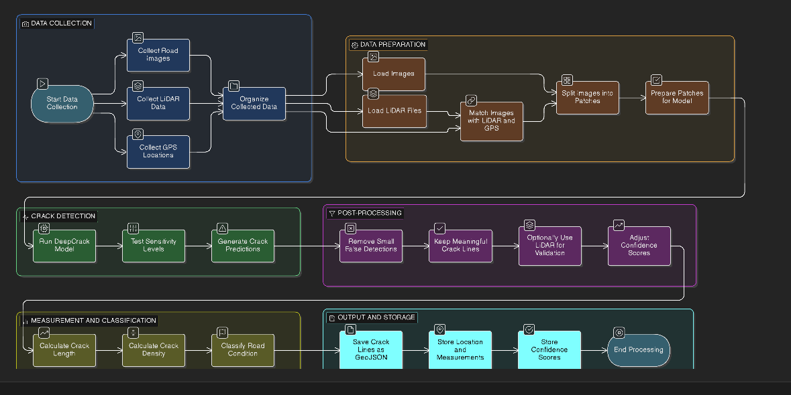

# deepcrack_model


# deepcrack_model

**DeepCrack Road Damage Detection System**

End-to-end prototype system for detecting and measuring road cracks using deep learning.
Designed for research validation and medium-sized datasets.

---

## Project Overview

This project provides a structured pipeline for automatically detecting, measuring, and classifying road cracks using high-resolution imagery and optional LiDAR data.

### Objectives

* Automate crack detection from road survey data
* Reduce manual inspection effort
* Generate measurable and georeferenced crack statistics
* Support infrastructure condition assessment workflows

This is currently a prototype-level implementation.

---


## System Design




## Big Picture Workflow

### Step 1 — Data Collection

Collected data includes:

* Road surface images
* LiDAR point cloud data (optional but recommended)
* GPS coordinates

All datasets are organized and spatially aligned before processing.

---

### Step 2 — Data Preparation

Because raw road images are large, they must be prepared before inference.

The system:

* Loads images
* Loads LiDAR files
* Matches images with GPS and LiDAR data
* Splits large images into smaller patches (tiling)
* Prepares patches for deep learning inference

This ensures stable and memory-efficient processing.

---

### Step 3 — Crack Detection (Model Inference)

The DeepCrack-based segmentation model:

* Processes image patches
* Generates pixel-level crack masks
* Produces confidence values

Fine cracks are detected at pixel resolution.

---

### Step 4 — Post-Processing

Raw model outputs may contain noise.

Post-processing includes:

* Removing small false detections
* Cleaning crack regions
* Vectorizing crack lines
* Optional LiDAR validation
* Adjusting confidence scores

This improves real-world reliability.

---

### Step 5 — Measurement & Classification

Detected cracks are converted into measurable features:

* Crack length
* Crack density
* Spatial distribution

Road segments are classified based on defined thresholds:

* Good
* Fair
* Poor

---

### Step 6 — Output & Storage

Final outputs include:

* GeoJSON crack lines
* Location-based measurements
* Confidence scores
* Visual overlay images

Outputs are compatible with GIS systems and reporting dashboards.

---

## System Architecture Summary

### Input

* Images
* LiDAR (optional)
* GPS

### Processing

* Preprocessing
* Deep learning inference
* Post-processing
* Measurement

### Output

* Georeferenced crack data
* Condition classification
* Confidence metrics

---

## Project Structure

```
deepcrack_model/
│
├── data/                  # Raw images and LiDAR (not committed)
├── models/                # Model weights
├── preprocessing/         # Tiling and data alignment scripts
├── inference/             # Model execution scripts
├── postprocessing/        # Cleaning and vectorization
├── evaluation/            # Metrics and validation
├── outputs/               # Generated results
├── requirements.txt
└── README.md
```

---

## Installation & Setup

### 1. Clone Repository

```
git clone https://github.com/jeebanbashyal/deepcrack_model.git
cd deepcrack_model
```

### 2. Create Virtual Environment

**Windows (PowerShell)**

```
python -m venv venv
.\venv\Scripts\Activate.ps1
```

**macOS / Linux**

```
python -m venv venv
source venv/bin/activate
```

---

### 3. Install Dependencies

```
pip install -r requirements.txt
```

If the requirements file does not exist:

```
pip install torch torchvision opencv-python pillow numpy matplotlib shapely geopandas
pip freeze > requirements.txt
```

---

## Running the System

Basic example:

```
python inference/run_model.py --input data/images --output outputs/
```

Adjust arguments according to your script implementation.

---

## Current Status

* Prototype implementation
* Medium dataset testing completed
* Manual QA recommended
* LiDAR currently used for validation (not full multimodal fusion)

---

## Collaboration Model

This repository is private.

If external collaborators require access:

* Provide repository access directly
* Or temporarily make public for fork
* Submit changes via Pull Requests
* All merges require repository owner approval

This ensures version control and quality management.

---

## Future Improvements

Planned enhancements include:

* Full LiDAR + RGB multimodal training
* Automated quality assurance module
* Web-based GIS visualization dashboard
* Large-scale deployment optimization
* Automated model retraining pipeline

---

## License

MIT License

---

## Final Big Picture

This project is not just a crack detector.

It is a structured pipeline for:

Data → AI Analysis → Measurement → Classification → GIS-ready Output

Designed as a foundation for scalable road infrastructure monitoring systems.
